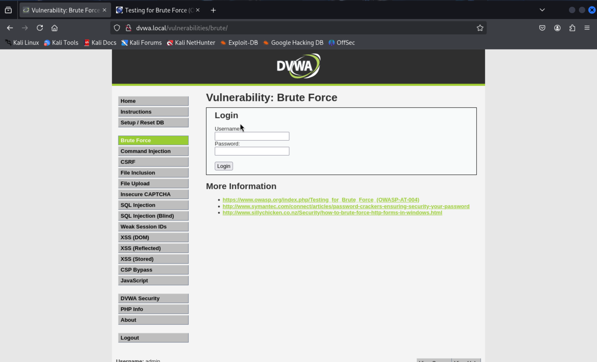
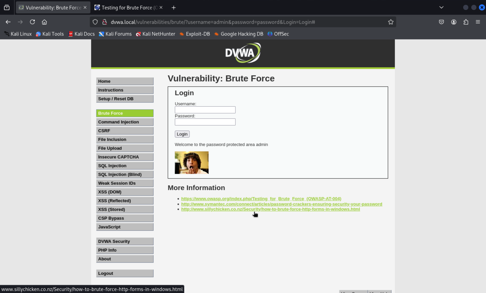

# DVWA Brute Force Attack: A Personal Journey

## Introduction

Hey there! Today, I'm excited to share my adventure in exploiting the brute force vulnerability in DVWA (Damn Vulnerable Web Application). This journey took me from setting up the environment to successfully executing the attack. Remember, this was all done in a controlled, legal environment for educational purposes.

## Environment Setup

For this exercise, I set up DVWA using Docker on my local machine and accessed it from Kali Linux running in VMware. Here's how I did it:

1. Deployed the DVWA container on my host machine.
2. Configured the Kali Linux VM network adapter in bridged mode.
3. Added the host machine's IP to Kali's `/etc/hosts` file as `dvwa.local`.


## The Brute Force Attack

### Initial Reconnaissance

I started by accessing the DVWA interface and navigating to the "Brute Force" section:



The page presented a simple login form with two key security weaknesses I could exploit:
1. No limit on login attempts.
2. Clear error messages that reveal whether the attempt failed:


### Attack Execution

I decided to use Hydra, a powerful brute force tool in Kali Linux. My attack strategy had two phases:

1. **Initial Test**: I used a small custom wordlist to verify the attack would work:
```bash
hydra -l admin -P wordlist.txt dvwa.local http-post-form "/vulnerabilities/brute/:username=^USER^&password=^PASS^&Login=Login:Username and/or password incorrect." -V
```

The initial test was successful:


2. **Full Attack**: I scaled up using the rockyou.txt wordlist:
```bash
hydra -l admin -P /usr/share/wordlists/rockyou.txt dvwa.local http-post-form "/vulnerabilities/brute/:username=^USER^&password=^PASS^&Login=Login:Username and/or password incorrect." -V
```

The full attack revealed multiple valid passwords:


### Results Analysis

The brute force attack revealed several interesting findings:

1. Valid credentials discovered:
   - admin:123456
   - admin:password
   - admin:letmein
   - admin:admin
   - admin:jessica
   - admin:princess
   - admin:rockyou
   And several others...

2. Attack Statistics:
   - Time taken: ~1 minute
   - Number of attempts: 14344399 possible combinations
   - Success rate: Multiple valid combinations found

### Successful Access

To verify the findings, I tested one of the discovered credentials:



The success message "Welcome to the password protected area admin" confirmed our attack had worked.

## Security Implications

This exercise demonstrated several security concerns:

1. No rate limiting on login attempts.
2. Clear text error messages revealing valid/invalid attempts.
3. Common passwords accepted.
4. No multi-factor authentication.

## Mitigation Recommendations

Based on this exercise, I would recommend:

1. Implement account lockout after X failed attempts.
2. Add CAPTCHA or similar challenge-response system.
3. Enforce stronger password policies.
4. Add rate limiting.
5. Use generic error messages.
6. Consider implementing 2FA.

## Conclusion

This exercise demonstrated how easily weak authentication systems can be compromised using readily available tools. It emphasizes the importance of implementing proper security controls in production environments.

## Tools Used
- VMware for running Kali Linux.
- Hydra for brute force attacks.
- Custom wordlist and rockyou.txt dictionary.

## Disclaimer

This walkthrough documents a security testing exercise performed in a controlled, isolated environment for educational purposes. Always obtain proper authorization before performing security testing on any system. 