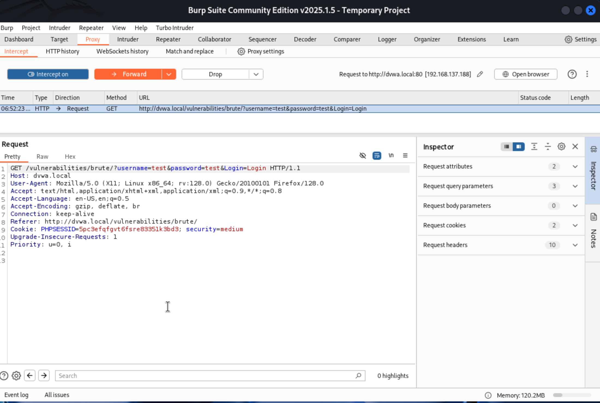

# DVWA Brute Force Attack: My Penetration Testing Journey

## Introduction

Hey there! In this report, I'm documenting my hands-on experience exploiting the brute force vulnerability in DVWA (Damn Vulnerable Web Application). I'll walk you through my approach to testing this vulnerability across different security levels - from low to high. This exercise was performed in a controlled environment for educational purposes.

## Environment Setup

For this exercise, I set up DVWA using Docker on my Mac (you can find the configuration file I used here: [docker-compose.yml](../docker-compose.yml)) and accessed it from Kali Linux running in VMware. Here's a quick look at my Docker container running DVWA:


The networking between my Kali VM and the Docker container on my host machine was configured to allow communication. You can see the detailed steps for that here: [Host Networking Setup](../setup/host-networking.md). This setup allowed my Kali VM to reach the DVWA instance using the hostname `dvwa.local`.

## Security Levels in DVWA

DVWA offers different security levels that implement various protection mechanisms:


As shown above, I started testing at the lowest security level and gradually increased the difficulty.

## Exploiting Brute Force Vulnerability

### Low Security Level

At the low security level, DVWA has no protection against brute force attacks - no rate limiting, no CAPTCHA, and no account lockout:

#### 1. Initial Reconnaissance

First, I examined the login form and verified that failed attempts display clear error messages:


I tested a few login attempts manually to understand how the application responds to failed and successful login attempts:


#### 2. Using Hydra

For the low security level, I used Hydra, which is perfect for this scenario. I started with a small custom wordlist:

```bash
hydra -l admin -P wordlist.txt dvwa.local http-post-form "/vulnerabilities/brute/:username=^USER^&password=^PASS^&Login=Login:Username and/or password incorrect." -V
```

The attack quickly revealed several valid credentials:


I then scaled up using the more comprehensive rockyou.txt wordlist, which revealed even more passwords:


### Medium Security Level

At the medium security level, DVWA implements a 2-second delay between login attempts. This makes Hydra less efficient, so I switched to Burp Suite.

#### 1. Understanding the Medium Level Protection

I checked the source code to understand the protection mechanism:


As you can see, the code uses `sleep(2)` to delay responses, slowing down automated attacks.

#### 2. Setting up Burp Suite

I configured Firefox to use Burp Suite as a proxy and intercepted a login request:



#### 3. Using Burp Intruder

After capturing a sample login request, I sent it to Burp Intruder and set up the attack:

1. I first cleared all default payload positions by clicking the "Clear §" button, then manually added my own positions by highlighting the username and password parameters in the request and clicking "Add §":

   

2. I selected "Cluster bomb" attack type which allows me to use different payload sets for each position (username and password):

   

3. For payload configuration, I needed to set up two separate payload sets:
   - Payload set 1 (username): I used a list of common usernames
   - Payload set 2 (password): I used a common password list

   

4. I configured both payload sets to use runtime files from Kali Linux's built-in wordlists:

   
   

5. I started the attack by clicking a Start Attack button and let it run for some time.


#### 4. Analyzing Results

After the attack completed, I sorted the results by response length. Successful logins had a distinctly different response length (4750 bytes vs 4712 bytes for failed attempts):


The longer response length indicates a successful login because it includes the welcome message and avatar image, making the HTML response larger than the failed login page. This difference in response size is a key indicator that lets us identify successful logins without having to manually check each result. The combination `admin:password` was identified as valid:


### High Security Level

Now for the tricky part! The high security level adds anti-CSRF tokens and introduces a random delay on failed login attempts.

#### 1. Examining the High Level Protection

First, I set the DVWA security level to high:


Then, I looked at the source code for this level:


Key protections here include:
- `checkToken()`: Validates a `user_token` (CSRF token) against the session, making simple request replays fail.
- `sleep(rand(0, 3))`: Introduces a *random* delay between 0 and 3 seconds after *each failed* login. This doesn't lock the account but makes automated attacks slower and less predictable.

#### 2. Adapting the Burp Suite Approach: Handling CSRF Tokens

Because the `user_token` changes with each request, a simple Intruder attack won't work. The token sent with each attempt would be invalid. To overcome this, I used Burp Suite's session handling rules and macros to automatically fetch a fresh token before each Intruder request.

Here's how I set it up, following the logical flow within Burp:

1.  **Navigate to Session Handling Rules:** I went to `Proxy Settings` -> `Sessions` -> `Session Handling Rules` tab and clicked "Add" to create a new rule.

    

2.  **Add Rule Action (Run Macro):** Under the "Rule Actions" section of the rule editor, I clicked "Add" and selected "Run a macro". This tells Burp to execute a specific sequence of requests (the macro) before the main request is processed.

    

3.  **Create the Macro:** Since I didn't have a macro yet, I clicked the "Add" button in the "Select macro" section of the Rule Action editor. This opened the Macro Recorder/Editor.

    I recorded a simple macro that performs one action: sending a GET request to the brute force page (`/vulnerabilities/brute/`). This request's response contains a valid `user_token`.

    

4.  **Configure Macro Item & Parameter Extraction:** Back in the Macro Editor, I selected the recorded GET request.

    

    The crucial step was telling Burp how to *extract* the token from the response of this macro request. I clicked "Configure item", went to the "Parameter handling" section, and clicked "Add" to define a custom parameter.

    I named the parameter `user_token` and configured Burp to extract its value from the response body using delimiters targeting the hidden input field `user_token`:

    

5.  **Configure Rule Action Settings:** After defining the macro and the parameter extraction, I returned to the Rule Action editor. Here, I ensured the settings were correct to:
    *   Run the newly created Macro.
    *   Update the *current request* (the one Intruder is about to send) with parameters derived from the macro's final response (i.e., insert the extracted `user_token`).
    *   Selected "Tolerate URL mismatch" for robustness.

    

6.  **Configure Rule Scope:** Finally, in the main Session Handling Rule Editor, I went to the "Scope" tab. I configured the rule to apply *only* to the Intruder tool and *only* for requests to the brute force vulnerability URL, ensuring it doesn't interfere with other requests.

    

7.  **Final Session Rule:** My final session handling rule was now configured and enabled, ready to automatically handle the CSRF tokens for my Intruder attack:

    

#### 3. Setting Up Intruder for High Level

With the session handling rule in place, I could now set up the Intruder attack similar to the medium level, but targeting the high-level endpoint `/vulnerabilities/brute/index.php`:

1.  **Intercept POST Request:** I intercepted a sample POST login request to send to Intruder. Notice the `user_token` parameter is present:

    

2.  **Configure Intruder:**
    *   Sent the intercepted POST request to Intruder.
    *   Cleared default positions (§) and marked only the `username` and `password` parameters as payload positions. The `user_token` position was left *unmarked* because the session rule handles updating it.
    *   Selected "Cluster bomb" attack type.
    *   Configured payload sets 1 (username) and 2 (password) using appropriate wordlists:

        
        

    *   Under Intruder -> Settings, I checked error handling options:

        

#### 4. Launching and Analyzing the High-Level Attack

I launched the attack by clicking the "Start attack" button:


Because the high level still gives different responses for success vs. failure (even with the CSRF token handled and the random sleep), analyzing results required a specific approach.

I used Burp Intruder's "Grep - Match" setting (under `Settings` -> `Attack results`). I added a rule to flag responses that *contained* the word "Incorrect".


With this setup, any result that was *not* flagged by this rule was a potential success, as it didn't contain the failure message.

When applying the filter (by clicking the "Incorrect" column header to sort or filter), the successful combination(s) which *didn't* trigger the Grep match were clearly visible:


As suspected, the `admin:password` combination worked even at the high security level, thanks to the automated CSRF token handling via the session rule and macro.

Finally, I verified the successful login manually:


## Security Implications

This exercise demonstrated several security concerns across different levels:

1. **Low Level**:
   - No rate limiting on login attempts
   - Clear text error messages
   - No account lockout or delays

2. **Medium Level**:
   - Simple time delays can be bypassed with patience
   - Still no account lockout after multiple failures

3. **High Level**:
   - CSRF protection can be bypassed with session handling rules.
   - Random delays slow attacks but don't prevent them.
   - Still vulnerable if weak/common passwords are used, as there's no lockout.

## My Recommendations for Mitigation

Based on what I found trying to break this login form, here are some things I'd definitely recommend doing to make brute force attacks much harder:

1.  **Implement Automatic Account Lockouts:** After a small number of failed login attempts (say, 3 to 5), the system should automatically lock the account for a period (like 15-30 minutes). This should happen automatically, without needing someone to step in. It's also a good idea to send an alert (like an email) to the user and maybe the security team when an account gets locked.

2.  **Bring in Multi-Factor Authentication (MFA):** This is a big one. Requiring a second piece of proof, like a code sent via SMS to a phone number or generated by an authenticator app, makes having just the password useless for an attacker.

3.  **Use CAPTCHAs Smartly:** Instead of showing a CAPTCHA on every single login (which annoys users), maybe bring it in after one or two failed attempts. This stops simple automated scripts in their tracks without frustrating legitimate users too much.

4.  **Monitor for Attacks:** The system should keep an eye out for lots of failed logins coming from the same IP address or targeting the same account. When suspicious patterns are spotted, alerts should be triggered so someone can investigate.

5.  **Keep Error Messages Vague:** Don't tell the attacker *why* the login failed. Instead of saying "Incorrect password" or "User not found," just use a generic message like "Invalid username or password." This gives the attacker less information to work with.

6.  **Enforce Stronger Passwords:** Encourage or require users to create passwords that aren't easy to guess. Think minimum length, maybe requiring different character types (uppercase, lowercase, numbers, symbols), and definitely check against lists of common or previously breached passwords.

## Conclusion: What I Learned

So, what did I learn from all this? It was really eye-opening to see how easily I could get past the login on the low setting using Hydra. The medium level took a bit more effort with Burp Suite because of the delay, but it was still very doable. The high level was the most interesting – even with CSRF protection, setting up that session handling rule in Burp allowed me to bypass it and find the password, mainly because there wasn't a proper lockout.

It made me fully realized that just one security measure often isn't enough. You need layers like combining lockouts, MFA, and maybe CAPTCHAs to properly defend against these kinds of attacks.

## Tools I Used
- Kali Linux running in VMware
- Hydra for the low-level attack
- Burp Suite Community Edition for tackling the medium and high levels
- Various wordlists (including the rockyou.txt)

## Just a Heads-Up (Disclaimer)

Everything I described here was part of a learning exercise I did on my own setup. I was testing a Damn Vulnerable Web Application (DVWA) in a controlled environment specifically designed for this kind of practice. Remember, you should *never* try these techniques on systems you don't have explicit permission to test – that's illegal and unethical! 